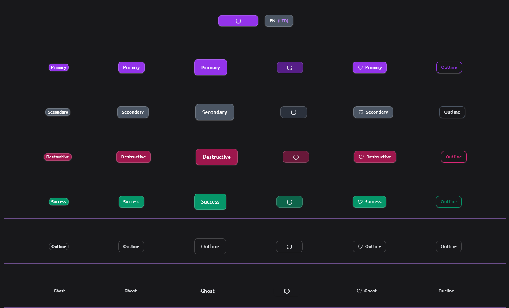

# Button Preview

This preview built with [**Class Variance Authority (CVA)**](https://cva.style/docs) and [**Tailwind Merge**](https://github.com/dcastil/tailwind-merge) to demonstrate how we could make a multiple button variants with the same base styles and different colors, sizes and add an outline or not.

## Screenshots

## Built with
- [React](https://reactjs.org/) - JS library
- [Tailwind CSS](https://tailwindcss.com/) - CSS framework
- [Class Variance Authority (CVA)](https://cva.style/docs) - This library creates variants of any component by providing multiple options for the variance like variant type, size, shape, and any other type of information used to create a unique variant.
- [Tailwind Merge](https://github.com/dcastil/tailwind-merge) - Utility function to efficiently merge Tailwind CSS classes in JS without style conflicts.

## Author
- Website - [Mohanad Portfolio](https://mohanad.in)
- Twitter - [@MohanadOO\_](https://twitter.com/MohanadOO_)
- Linkedin - [Mohanad Alrwaihy](https://www.linkedin.com/in/mohanad-alrwahiy-176aa719b/)
